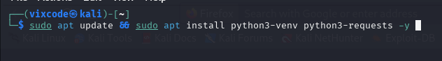
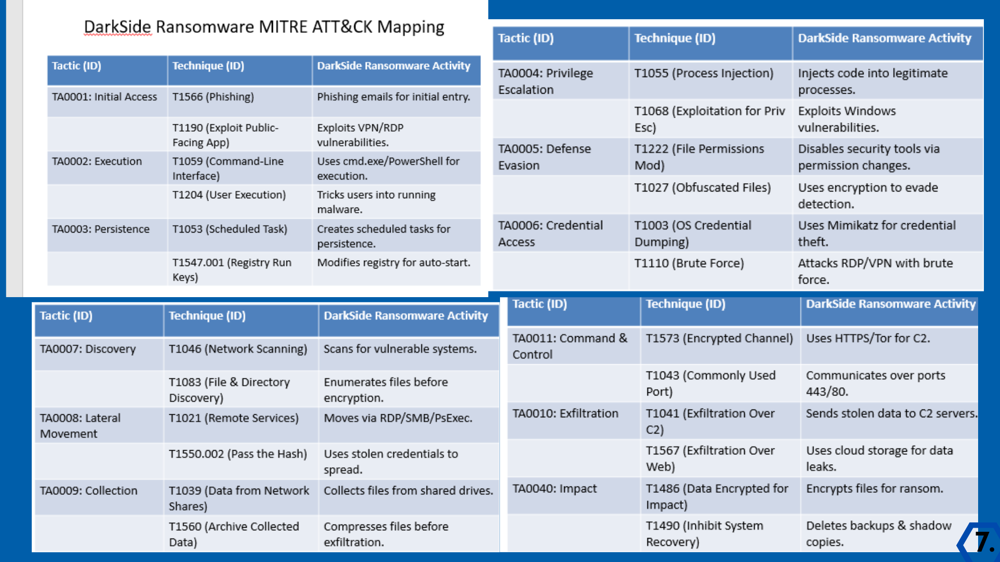

# Threat Intelligence Report: Malware Hash Analysis and YARA Rule Creation (1)

### 

---

### **Title Page**

- **Report Title**: Threat Intelligence Report: Malware Hash Analysis and YARA Rule Creation
- **Student Name**: Victoria Simon
- **Student ID**:
- **Course Name**: Advanced Cyber Threat Analysis
- **Instructor Name**: Mr Valentine
- **Date of Submission**: [22/03/2025]
- **Version**: kali 2025

---

### **Executive Summary**

This report documents the analysis of a dataset containing 50 SHA-256 hash values to identify a malicious sample associated with a resurfaced malware strain. Using the VirusTotal API, a Python script was developed to automate the analysis of each hash. A malicious hash was identified, and thorough threat intelligence research was conducted to understand the malware's history, tactics, and impact. Based on the findings, a YARA rule was created to detect the malware in future attacks. The report concludes with recommendations for proactive cybersecurity measures to mitigate similar threats.

---

### **Lab Objectives**

The primary objectives of this lab were:

1. **Identify the Malicious Hash**: Use the VirusTotal API to analyze 50 SHA-256 hash values and identify a malicious sample.
2. **Conduct Threat Intelligence Research**: Investigate the malware's history, tactics, and impact.
3. **Create a YARA Rule**: Develop a YARA rule to detect the malware based on its hash, strings, file characteristics, and behavioral indicators.
4. **Prepare a Comprehensive Report**: Document the analysis, findings, and recommendations for executive leadership.

---

### **Tools and Resources Used**

1. **VirusTotal API**: Used to analyze hash values and identify malicious samples.
2. **Python**: Used to automate the hash analysis process with the `requests` library.
3. **YARA**: Used to create a detection rule for the identified malware.
4. **Text Editor**: Used to write and edit the Python script and YARA rule.
5. **Threat Intelligence Sources**: Used to research the malware's history, tactics, and impact.

---

### **Methodology**

The lab was conducted in the following steps:

1. **Install Required Packages**:
    - Installed the `requests` library in Python to interact with the VirusTotal API.
    
    sudo apt update && sudo apt install python3-venv python3-requests -y 
    
    
    
    bashshell running the python3-request command
    
2. **Obtain VirusTotal API Key**:
    - Signed up for a VirusTotal account and obtained an API key.
    
    
    
    VirusTotal API 
    

1. **Create Python Script**:
    - Developed a Python script (`check_hashes.py`) to automate the analysis of 50 SHA-256 hash values using the VirusTotal API.
    
    [python script for detecting malicious Hash](https://github.com/Cybervixy/Threat-Intell-on-Darkside-Ransomeware/blame/74f76ab549fc7d5509e65c81e3148de881bbca65/python%20script%20for%20detecting%20malicious%20Hash)
    
2. **Run the Script**:
    - Executed the script to identify the malicious hash and extract relevant details from VirusTotal's response.
    
    
    
    Flagged malicious  hash
    
3. **Conduct Threat Intelligence Research**:
    - Researched the malware's history, notable attacks, threat actors, motivation, tactics, attack lifecycle, current status, and detection strategies.
4. **Create YARA Rule**:
    - Developed a YARA rule to detect the malware based on its hash, strings, file characteristics, and behavioral indicators.
5. **Test the YARA Rule**:
    - Tested the YARA rule on the identified malicious sample to ensure accurate detection.

---

### **Analysis and Findings**

1. **Malicious Hash Identification**:
    - The hash 156335b95ba216456f1ac0894b7b9d6ad95404ac7df447940f21646ca0090673  was flagged as malicious by multiple antivirus vendors on VirusTotal with a community score of 63/72 as at the 22nd of March, 2025.


### **Threat Intelligence Research: Darkside Ransomware**

### **1. History of the Malware**

- **Emergence**: Darkside Ransomware first emerged in **2020**. It gained significant attention in **2021-06-02 09:45:36 UTC** due to its involvement in high-profile attacks, including the Colonial Pipeline attack in the United States.
- **Evolution**: The malware is believed to be a product of a **ransomware-as-a-service (RaaS) model**, where the developers lease the ransomware to affiliates who carry out the attacks.
- **Current Status**: As of **2023**, Darkside Ransomware is still active, although its operations have been disrupted by law enforcement and cybersecurity firms. The group behind Darkside has rebranded and continues to operate under different names.

---

### **2. Notable Attacks**

- **Colonial Pipeline Attack (2021)**: One of the most infamous attacks attributed to Darkside Ransomware. The attack caused a temporary shutdown of the Colonial Pipeline, leading to fuel shortages across the U.S. East Coast.
- **Targeted Industries**: Darkside primarily targets **critical infrastructure sectors**, including energy, healthcare, and manufacturing. The group focuses on organizations that can afford to pay large ransoms.
- **Geographic Focus**: While the group has targeted organizations globally, the majority of its attacks have been concentrated in **North America** and **Europe**.

---

### **3. Threat Actor**

- **Group Name**: The group behind Darkside Ransomware is known as **Darkside** or **DarkSide**. They operate as a **Ransomware-as-a-Service (RaaS)** group.
- **Affiliation**: Darkside is believed to have ties to other cybercriminal groups, including **REvil** and **BlackMatter**. These groups share infrastructure, tools, and tactics.
- **Motivation**: The primary motivation is **financial gain**. The group demands ransom payments in cryptocurrency (usually Bitcoin) and has been known to exfiltrate data before encrypting files, using the threat of data leakage to pressure victims into paying.

---

### **4. Motivation & Tactics**

- **Motivation**: The group is financially motivated, targeting organizations that can pay large ransoms. They also engage in **double extortion**, where they not only encrypt files but also threaten to leak stolen data if the ransom is not paid.
- **Tactics**:
    - **Initial Access**: Darkside typically gains access to victim networks through **phishing emails**, **exploiting vulnerabilities** in Remote Desktop Protocol (RDP), or purchasing access from initial access brokers.
    - **Lateral Movement**: Once inside the network, the group uses tools like **Mimikatz** to escalate privileges and move laterally across the network.
    - **Data Exfiltration**: Before encrypting files, the group exfiltrates sensitive data to use as leverage in ransom negotiations.
    - **Encryption**: Darkside uses strong encryption algorithms to lock files and demands payment for the decryption key.

---

### **5. Attack Lifecycle**

in the figure below.


*Image source: https://www.fireeye.com/content/dam/fireeye-www/blog/images/darkside/fig3b.png*

---

# MITRE ATT&CK tactics and techniques

Below are the MITRE ATT&CK tactics and techniques associated with DarkSide Ransomware.



Mitre Att&ck mapping of Darkside Ransomeware

# Initial access

The various analyzed samples of DarkSide ransomware show that phishing, remote desktop protocol (RDP) abuse, and exploiting known vulnerabilities are the commonly used tactics by the group to gain initial access. DarkSide group also uses legitimate tools throughout the attack chain to remain obfuscate its attack and to remain undetected.

Below is the comprehensive list of legitimate tools used by the group throughout the reconnaissance and gaining-entry phases of the attack:

- PowerShell: for reconnaissance and persistence
- Metasploit Framework: for reconnaissance
- Mimikatz: for reconnaissance
- BloodHound: for reconnaissance
- Cobalt Strike: for installation

For a modern ransomware attack like the DarkSide, gaining initial access no longer immediately leads to ransomware being dropped onto the victim’s machine. There are now several steps that follow in between that are often manually executed by the threat actor.

# Lateral movement and privilege escalation

Lateral movement is one of the key discovery phases in any modern ransomware process. The end goal is to identify all the critical data within the victim’s network, which includes the target files and locations to facilitate the upcoming exfiltration and encryption steps.

In the case of DarkSide, the goal of lateral movement activity is to gain Domain Controller (DC) or Active Directory access, which will be further used to steal credentials, escalate privileges, and acquire other valuable assets for data exfiltration. The group laterally moves through the systems, eventually using the DC network share to deploy the ransomware to connected machines. As per the observation, the DarkSide group deployed PSExec and RDP.

# Exfiltration

The critical files are exfiltrated before the ransomware is being launched. This is the riskiest step in the DarkSide ransomware execution process, as data exfiltration is more likely to be noticed by the victim organization’s cybersecurity team. It is the last step before any ransomware is dropped, and the attack often speeds up at this point to complete the process before it is detected and stopped.

# For exfiltration, these were the tools being used:

- 7-Zip: a utility used for archiving files to prepare for exfiltration of critical data
- Rclone and Mega client: tools used for exfiltrating files to the cloud storage
- PuTTy: an alternative application used for network file transfer

DarkSide uses several Tor-based leak sites to host victim’s stolen data. The file-sharing services used by the DarkSide group for data exfiltration include Mega and PrivatLab.

# Execution and impact

The execution of the actual ransomware follows next. It is to be noted that the DarkSide ransomware shares many similarities with REvil in this step of the process, which includes the structure of ransom notes and the use of PowerShell to execute a command which eventually deletes shadow copies from the network. On code analysis, it was found that the same code checks were used by this ransomware to check whether the victim is located in a commonwealth of Independent States (CIS) country or not.

The PowerShell is used to install and operate the malware itself, while Certutil and Bitsadmin were used to download the ransomware. Two encryption methods were used, depending on whether the target operating system is Windows or Linux: A ChaCha20 stream cipher with RSA-4096 is used on Linux, whereas Salsa20 with RSA-1024 is used on Windows.

### **6. Current Status**

- **Active Status**: Darkside Ransomware is still active, although its operations have been disrupted by law enforcement and cybersecurity firms. The group has rebranded and continues to operate under different names.
- **Mitigation Efforts**: Many organizations have implemented **endpoint detection and response (EDR)** solutions, **network segmentation**, and **regular backups** to mitigate the impact of Darkside attacks. Law enforcement agencies have also taken down some of the group’s infrastructure.

---

### **Relationship Summary**

| 156335b95b... | Connected_To | baroquetees.com |
| --- | --- | --- |
| 156335b95b... | Connected_To | rumahsia.com |
| 156335b95b... | Dropped | 3ba456cafcb31e0710626170c3565aae305bc7c32a948a54f0331d0939e0fe8a |
| 156335b95b... | Dropped | f6fba207c71d1f53f82d96a87c25c4fa3c020dca58d9b8a266137f33597a0b0e |
| baroquetees.com | Resolved_To | 176.103.62.217 |
| baroquetees.com | Connected_From | 156335b95ba216456f1ac0894b7b9d6ad95404ac7df447940f21646ca0090673 |
| 176.103.62.217 | Resolved_To | baroquetees.com |
| rumahsia.com | Resolved_To | 99.83.154.118 |
| rumahsia.com | Connected_From | 156335b95ba216456f1ac0894b7b9d6ad95404ac7df447940f21646ca0090673 |
| 99.83.154.118 | Resolved_To | rumahsia.com |
| 3ba456cafc... | Dropped_By | 156335b95ba216456f1ac0894b7b9d6ad95404ac7df447940f21646ca0090673 |
| f6fba207c7... | Dropped_By | 156335b95ba216456f1ac0894b7b9d6ad95404ac7df447940f21646ca0090673 |

### **7. Detection & Prevention Strategies**

- **Detection**:
    - **YARA Rules**: Use YARA rules to detect Darkside Ransomware based on its hash, strings, and behavioral indicators.
    - **Endpoint Detection**: Deploy EDR solutions to monitor for suspicious activity, such as lateral movement and file encryption.
    - **Network Monitoring**: Monitor network traffic for signs of data exfiltration or communication with known command-and-control (C2) servers.
- **Prevention**:
    - **Email Filtering**: Implement advanced email filtering to block phishing attempts.
    - **Patch Management**: Regularly update systems to patch vulnerabilities, especially in RDP.
    - **Backup Strategy**: Maintain regular, offline backups to ensure data can be restored without paying the ransom.
    - **Employee Training**: Conduct regular cybersecurity awareness training to reduce the risk of phishing attacks.

---

### **YARA Rule for Darkside Ransomware**

Based on the intelligence gathered, here is a **YARA rule** to detect Darkside Ransomware:

yara

Copy

```
import hash
rule Windows_Ransomware_Darkside {
    meta:
        description = "Detects Darkside ransomware samples based on hashes, strings, and behavioral indicators"
        author = "Victoria Simon Omaojo"
        date = "2025-03-24"
        reference = "Internal Analysis"
        threat_name = "Windows.Ransomware.Darkside"
        severity = "critical"
        os = "windows"
        tlp = "white"
        hash = "156335b95ba216456f1ac0894b7b9d6ad95404ac7df447940f21646ca0090673"

    strings:
        // File indicators
        $suspicious_file1 = "C:\\Users\\Admin\\AppData\\Local\\Temp\\msil.dll" nocase ascii
        $suspicious_file2 = "C:\\Windows\\Temp\\spoolsvc.exe" nocase ascii
        $encryptor_dll = "encryptor2.dll" wide ascii
        $a = "i am malicious" nocase ascii
        
        // Process/execution patterns
        $dll_exec = "rundll32.exe" wide ascii nocase
        $kernel32_import = "KERNEL32.dll" wide ascii
        $disable_thread = "DisableThreadLibraryCalls" wide ascii
        
        // Network indicators
        $domain1 = "survey-smiles.com" nocase ascii
        $domain2 = "baroquetees.com" nocase ascii
        $domain3 = "rumahsia.com" nocase ascii
        
        // Registry persistence
        $run_regkey = "Software\\Microsoft\\Windows\\CurrentVersion\\Run" nocase ascii
        
        // Binary patterns
        $hex_pattern1 = { D24DC8855EDD487B3CD2D545F11031E1FA85C2F2440712445F67D105B326533A }
        $hex_pattern2 = { 66 c7 04 47 2a 00 c7 44 47 02 72 00 65 00 }
        
    

    condition:
           hash.sha256(0, filesize) == "156335b95ba216456f1ac0894b7b9d6ad95404ac7df447940f21646ca0090673" or
           any of them
            
           
       
}
```

### Testing the rule


### **Challenges and Solutions**

1. **Challenge**: Rate limiting by the VirusTotal API.
    - **Solution**: Implemented a 60-second delay after every 4 API requests to stay within the rate limit.  ore/zenith 2009132827 ….08036006971
2. **Challenge**: Identifying unique byte patterns in the malware.
    - **Solution**: leveraged on the yara rule from virusTotal
3. **Challenge**: testing the YARA rule.
    - **Solution**: since i do not have the darkside malicious file, i created an exe file to contain the string “ i am malicious” to test the rule.

---

### **Conclusion**

This lab provided hands-on experience in threat intelligence analysis and YARA rule creation. By identifying a malicious hash, conducting thorough research, and developing a detection rule, I gained a deeper understanding of how to proactively defend against cyber threats. The findings highlight the importance of continuous monitoring, threat intelligence sharing, and the use of tools like YARA for malware detection.

---

### **Recommendations**

1. **Implement Proactive Monitoring**: Use threat intelligence feeds and tools like YARA to detect and respond to malware threats in real-time.
2. **Enhance Email Security**: Deploy advanced email filtering solutions to block phishing attempts and malicious attachments.
3. **Regular System Updates**: Ensure all systems are regularly updated with the latest security patches to mitigate vulnerabilities.
4. **Employee Training**: Conduct regular cybersecurity awareness training to reduce the risk of social engineering attacks.
5. **Incident Response Planning**: Develop and test an incident response plan to quickly contain and remediate malware infections.

---

### **References**

1. VirusTotal. (2023). *VirusTotal API Documentation*. Retrieved from [https://developers.virustotal.com/](https://developers.virustotal.com/)
2. YARA Documentation. (2023). *Writing YARA Rules*. Retrieved from [https://yara.readthedocs.io/](https://yara.readthedocs.io/)
3. International Cybersecurity and Digital Forensics Academy. (2023). *Lab Assignment Template Guide*.
4. https://www.blackpanda.com/blog/what-is-darkside-ransomware
5. https://www.sisainfosec.com/blogs/darkside-ransomware-operations/
